Start time 17.30

## How to create a shopping list app in Django

This is a step by step guide to creating a Shopping list app with users, registrationand admin.

### Requirements

* Debian 11
* Django 3.2
* Sudo access
* A production server
* Some knowledge in object oriented programming

### Install virtualenv & Django

First I needed some software.

	sudo apt-get update
	sudo apt-get install -y virtualenv #The y-parameter answers yes to "are you sure?"
	cd
	mkdir shoppingtop
	cd shoppingtop
	mkdir shopping
	virtualenv env -p python3 --system-site-packages
	source env/bin/activate

After that I checked that I had the right env activated.

	which pip

```
(env) kallet@confmansys:~/shoppingtop/shopping$ 
```

The results were as expected. It's important to do this inside a controlled environment to prevent pip from installing Django to where ever it would like to. Next I laid down the requirements for my project and installed those. I also installed a nicer text editor & tree for inspecting the contents of directories.

	sudo apt-get install -y micro tree
	micro requirements.txt

```
#requirements.txt
django==3.2
```

	pip install -r requirements.txt 
	django-admin --version

```
(env) kallet@confmansys:~/shoppingtop/shopping$ django-admin --version
3.2
```

That was the installation for a virtual environment and Django 3.2 done.

## Starting a project and an app

I started  the project.

	django-admin startproject shopping
	tree shopping

```
(env) kallet@confmansys:~/shoppingtop/shopping$ tree shopping
shopping
├── manage.py
└── shopping
    ├── asgi.py
    ├── __init__.py
    ├── settings.py
    ├── urls.py
    └── wsgi.py

1 directory, 6 files
```
**This is the basic project structure of Django**

Next was the time to add an application.

	cd shopping #I moved inside my project
	django-admin startapp list
	cd ..
	tree -L 2

```
(env) kallet@confmansys:~/shoppingtop/shopping$ tree -L 2
.
├── env
│   ├── bin
│   ├── lib
│   └── pyvenv.cfg
├── requirements.txt
└── shopping
    ├── list
    ├── manage.py
    └── shopping

6 directories, 3 files
```

As you can see from the structure, my app resided inside the project. *This is important*. The tree's parameters show only a small part of the actual structure (ie. I omitted stuff to make it less confusing).

After that I wanted to get my admin-console going. This is a feature that Django offers as a standard feature and as such it will save a lot of time for actual, customer oriented development.

	cd shopping
	./manage.py migrate #this created a database for my app & project
	sudo apt-get install -y pwgen #for generating good passwords
	pwgen 80 1 -s #1 random password that's 80 characters long

There is no point in using weak passwords, even in a trivial project.

	./manage.py createsuperuser

```
(env) kallet@confmansys:~/shoppingtop/shopping/shopping$ ./manage.py createsuperuser
Username (leave blank to use 'kallet'): djangoadmin
Email address: 
Password: 
Password (again): 
Superuser created successfully.
```
	./manage.py createsuperuser
	./manage.py runserver
	#navigate to: http://127.0.0.1:8000/admin/

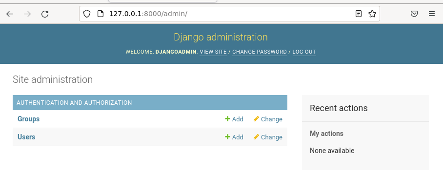  
**Desired outcome: Django admin console**

After that you should open another terminal for doing the development work to avoid shutting down the server all the time.

## Creating a model, adding it to admin and making first data inputs

Django can be used with function based views and model based views. This tutorial will use only Models. Don't worry about the views just yet. I think that a good habit to form is to work from your project directory and name your project and app dissimilarly, as it is faster to autofill your commands, files and directories with the tab-key. You'll need bash-completion for that.

You will need some expertise in object oriented programming and Python if you'd like to customize your application heavily, but copy & paste is a good way to learn too. Django's debug tools are excellent!

	sudo apt-get install -y bash-completion

### settings.py, models.py, admin.py
	
This is the file where all my models will reside. When I talk about models, all the stuff is generated from the models in this single file.

	pwd #Print Working Directory

```
/home/kallet/shoppingtop/shopping/shopping
```

	micro shopping/settings.py

```
#settings.py

INSTALLED_APPS = [
    'django.contrib.admin',
    'django.contrib.auth',
    'django.contrib.contenttypes',
    'django.contrib.sessions',
    'django.contrib.messages',
    'django.contrib.staticfiles',
    'list',
]

#add list to application list.
```
	
	micro list/models.py
	
```Python
#models.py
from django.db import models

class List(models.Model):
    shop_item = models.CharField(max_length=100)
```

Next I registered my model to admin.py.

	micro list/admin.py

```Python
from django.contrib import admin
from . import models

admin.site.register(models.List)
```

Next I checked my admin console for my model, and there it was!

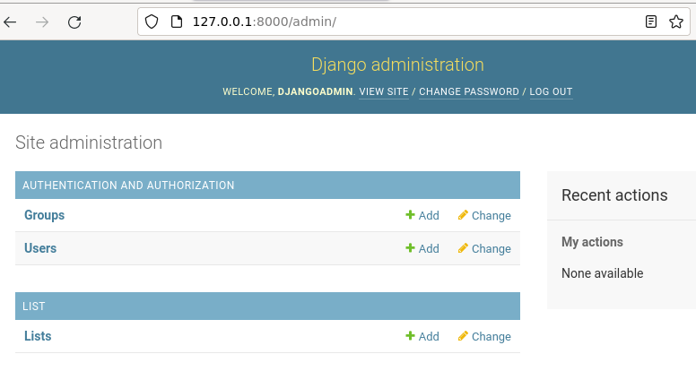  
**Desired outcome: Django admin connsole with my model**

After this I ran the migrations to make my database ready for some data. So I stopped my development server with ctrl + c.

	./manage.py makemigrations
	./manage.py migrate
	./manage.py runserver

*TIP*
ctrl + r lets you search from your command history, so you don't have to type as much.

Next I navigated to the admin console and added 2 items, milk and ketchup.

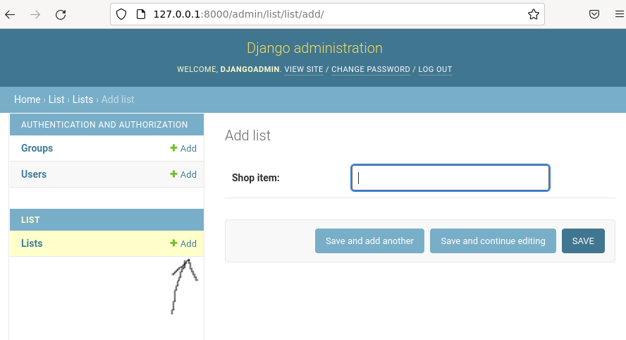  
**Desired outcome: Django admin console - adding data**

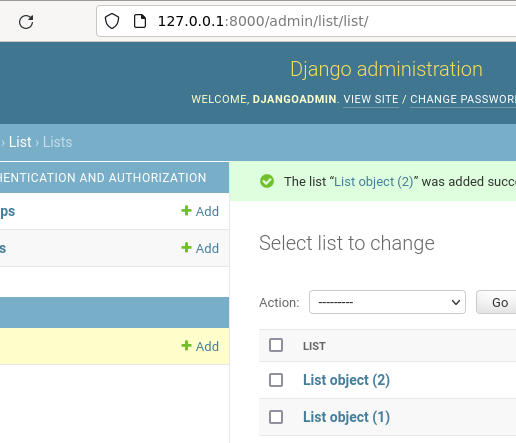  
**Desired outcome: Django admin console - added data**

To make things a bit nicer I added a method to my class that would return the shop_item attribute.

```Python
#models.py

from django.db import models

class List(models.Model):
    shop_item = models.CharField(max_length=100)

    def __str__(self):
        return f"{self.shop_item}"
```

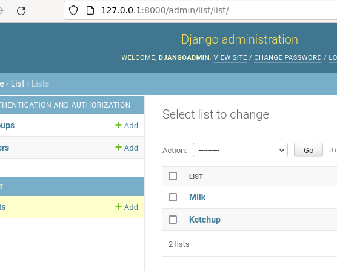  
**Desired outcome: Django admin console - added data with __str__ showing**

I took a break @ 18.50.

Back to work @ 19.14.

In reality I wanted a model with more fields, so I deleted the data that I had entered and modified my fields. (You don't have to delete the data, but I preferred that)

```Python
#Models.py

from django.db import models
from datetime import datetime

class List(models.Model):
    shop = models.CharField(max_length=100)
    shop_items = models.TextField()
    date = models.DateField(null=True, blank=True, default=datetime.today)

    def __str__(self):
        return f"{self.shop}"
```

So now I had a model with 3/4 of my components, and the final one would be the logged in user, so I made a field for that one too. 

```Python
#models.py

from django.db import models
from datetime import datetime
from django.contrib.auth.models import User

class List(models.Model):
    shop = models.CharField(max_length=100, default="")
    shop_items = models.TextField(default="")
    date = models.DateField(null=True, blank=True, default=datetime.today)
    shopper = models.ForeignKey(
            User,
            on_delete=models.CASCADE, default=""
        )

    def __str__(self):
        return f"{self.shop} {self.date}"
```

So, now I had my ducks in a line.

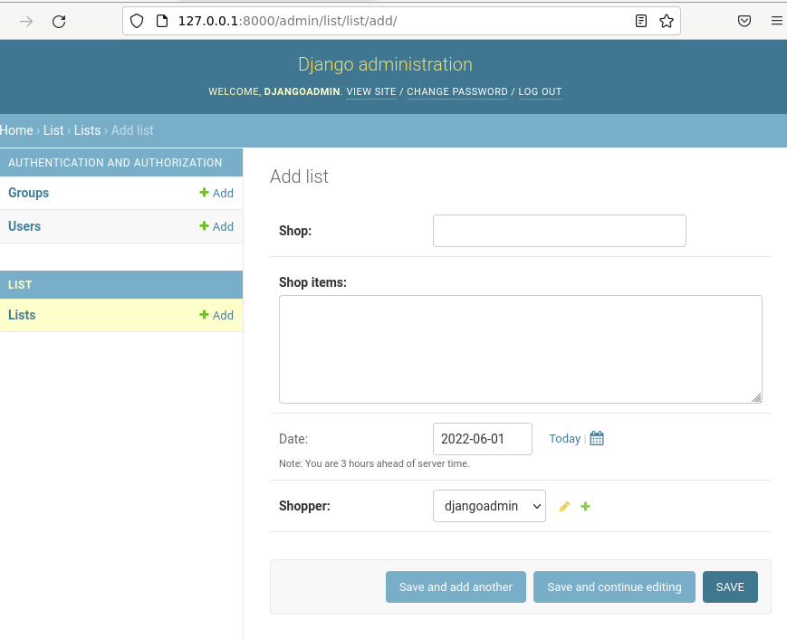  
**Desired outcome: Django admin console with a new model**

I added a fresh shopping list to my database (after migrations).

	#ctrl + c to stop the server
	./manage.py makemigrations
	./manage.py migrate
	./manage.py runserver

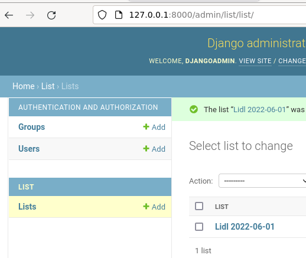  
**Desired outcome: Django admin console with data**

## Creating views

In this tutorial we'll use [generic model based views](https://docs.djangoproject.com/en/4.0/topics/class-based-views/generic-display/).  

The logical order to make views is:  
1. inputted url
2. urls.py
3. views.py
4. templates

My order for CRUD (Create Read Update Delete):
1. Read (ListView)
2. Read (DetailView)
3. Update (UpdateView)
4. Create (CreateView)
5. Delete (DeleteView)

This is how you can incrementally advance and use the excellent error messages for your development work.

## Read /  ListView

### Inputted url ListView

First I needed to decide on my future url for my lists, so I chose "/shoppinglist/". After that I navigated to:

	http://127.0.0.1:8000/shoppinglist/

### urls.py ListView

After that, the error message told me that shopping.urls doesn't contain the address, so I added that there. Here I realized that my application was poorly named, as it was a Python term. I didn't bother to change that, which could bring trouble later on.
	micro shopping/urls.py

```Python
#urls.py

from django.contrib import admin
from django.urls import path
from list import views

urlpatterns = [
    path('admin/', admin.site.urls),
    path('shoppinglist/', views.ShoppinglistListView.as_view()),
]
```

The error message told me that my views.py didn't have the view I was looking for.

```
  File "/home/kallet/shoppingtop/shopping/shopping/shopping/urls.py", line 7, in <module>
    path('shoppinglist/', views.ShoppingListView.as_view()),
AttributeError: module 'list.views' has no attribute 'ShoppingListView'
```

So, the logical next step was to create the view.

### views.py ListView

	micro list/views.py

```Python
from django.views.generic import ListView, DetailView, UpdateView, CreateView, DeleteView
from . import models

class ShoppingListView(ListView): 
    model = models.List
```

### Templates ListView

After that I tried navigating to: http://127.0.0.1:8000/shoppinglist/

The error message told me that I needed to make the template and it was kind enough to provide me with a default name for it too!

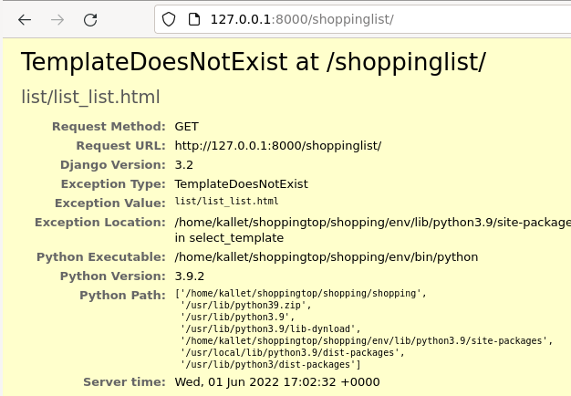  
**Desired outcome: Django TemplateDoesNotExist**

I created the templates folder and my new template under it.

	mkdir -p list/templates/list
	micro list/templates/list/list_list.html

```html
#list_list.html

hello, this is list_list.
```

After that I refreshed my browser with shift + reload. That didn't produce a change, so I restarted the dev server. I suspect that it doesn't realize that a folder has been created (later on you don't have to restart it to realize that there are more templates.).

Now I had a working template so I added some Django template magic to it.

```html
#list_list.html

{{ object_list }}
```

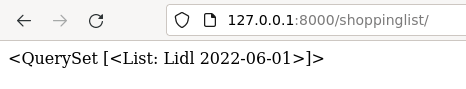  
**Desired outcome: Django {{ object__list }}**

To make things fancier, I added a control structure to iterate my objects.

```html
#list_list.html


	<p>{{ shoppinglist.date }}</p>
	<p><b>{{ shoppinglist.shop }}</b></p>
	<p>{{ shoppinglist.shop_items }}</p>
	<p>{{ shoppinglist.shopper }}</p>
	<hr>

```

I added one more shopping list in admin console to show an actual list in this view.

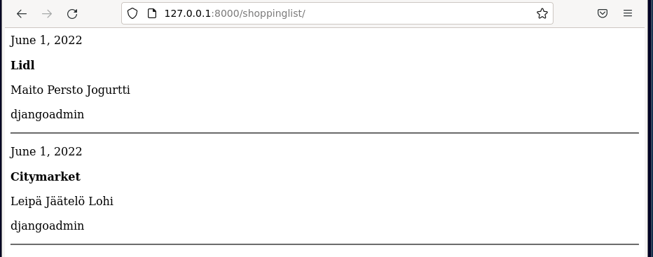  
**Desired outcome: Django **

## Read /  DetailView

### Inputted url

I chose: shoppinglist/1

I decided on a primary key for my url, since that is required on my database as a default and I didn't see any added value on customizing my primary keys. You can learn more about pk's in: https://www.ibm.com/docs/en/iodg/11.3?topic=reference-primary-keys
### urls.py

```Python
from django.contrib import admin
from django.urls import path
from list import views

urlpatterns = [
    path('admin/', admin.site.urls),
    path('shoppinglist/', views.ShoppingListView.as_view()),
    path('shoppinglist/<int:pk>', views.ShoppingDetailView.as_view()), #added this
]
```

### views.py

```Python
from django.views.generic import ListView, DetailView, UpdateView, CreateView, DeleteView
from . import models

class ShoppingListView(ListView): 
    model = models.List

class ShoppingDetailView(DetailView): #Added this
    model = models.List

```

### Templates

I realized that I needed to add one more method for my model that would return a primary key of the object in question.

```Python
#models.py

from django.db import models
from datetime import datetime
from django.contrib.auth.models import User

class List(models.Model):
    shop = models.CharField(max_length=100, default="")
    shop_items = models.TextField(default="")
    date = models.DateField(null=True, blank=True, default=datetime.today)
    shopper = models.ForeignKey(
            User,
            on_delete=models.CASCADE, default=""
        )

    def __str__(self):
        return f"{self.shop} {self.date}"

    def get_absolute_url(self): #Added this
        return f"/shoppinglist/{self.pk}" 
```

After that I added the template.

```
list_detail.html

<p>{{ object.date }}</p>
<p><b>{{ object.shop }}</b></p>
<p>{{ object.shop_items }}</p>
<br>
<p>{{ object.shopper }}</p>
<a href="{{ list.get_absolute_url }}/update">Update</a> - <a href="{{ list.get_absolute_url }}/delete">Delete</a>
```

## Update UpdateView

### Inputted url UpdateView

I added the url for this in my list_detail.html, so I just clicked on the update link.

### Urls UpdateView

```Python
#urls.py

from django.contrib import admin
from django.urls import path
from list import views

urlpatterns = [
    path('admin/', admin.site.urls),
    path('shoppinglist/', views.ShoppingListView.as_view()),
    path('shoppinglist/<int:pk>', views.ShoppingDetailView.as_view()),
    path('shoppinglist/<int:pk>/update', views.ShoppingUpdateView.as_view()),
]
```

### Views UpdateView

```Python
from django.views.generic import ListView, DetailView, UpdateView, CreateView, DeleteView
from . import models

class ShoppingListView(ListView): 
    model = models.List

class ShoppingDetailView(DetailView): 
    model = models.List

class ShoppingUpdateView(UpdateView): ##Added this
    model = models.List
    fields = "__all__"
```

### Templates UpdateView

```html
<h1>Add/Modify a shopping list</h1>
<form method=post>
	{{ form.as_p }}
	<input type="submit" value="Save">
</form>
```

## Delete DeleteView

### Inputted urls

As it was with the previous example, I just clicked my link for delete to get a good error message to work from. 

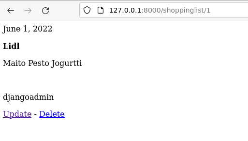  
**I just clicked on delete*

### Urls DeleteView

```Python
#urls.py 

from django.contrib import admin
from django.urls import path
from list import views

urlpatterns = [
    path('admin/', admin.site.urls),
    path('shoppinglist/', views.ShoppingListView.as_view()),
    path('shoppinglist/<int:pk>', views.ShoppingDetailView.as_view()),
    path('shoppinglist/<int:pk>/update', views.ShoppingUpdateView.as_view()),
    path('shoppinglist/<int:pk>/delete', views.ShoppingDeleteView.as_view()), ##added this
]
```

### Views DeleteView

```Python
#views.py

from django.views.generic import ListView, DetailView, UpdateView, CreateView, DeleteView
from . import models

class ShoppingListView(ListView): 
    model = models.List

class ShoppingDetailView(DetailView): 
    model = models.List

class ShoppingUpdateView(UpdateView): 
    model = models.List
    fields = "__all__"

class ShoppingDeleteView(DeleteView): 
    model = models.List
```

### Templates DeleteView

```html
#list_confirm_delete.html

<h1>Delete shopping list "{{ object.shop }} /  {{ object.date }}"</h1>
<form method=post>
	{{ form.as_p }}
	<input type="submit" value="Delete">
</form>
```

## Create

### Inputted urls CreateView

I added a link for creating a new entry to my list_list.html amd to my DetailView too.

```html
#list_list.html


	<p>{{ shoppinglist.date }}</p>
	<p><b><a href="{{ shoppinglist.get_absolute_url  }}">{{ shoppinglist.shop }}</a></b></p>
	<p>{{ shoppinglist.shop_items }}</p>
	<p>{{ shoppinglist.shopper }}</p>
	<hr>

<br>
<p><a href="new/"><button>Add new</button></a></p>
```

After that I clicked on the "Add new"-button and proceeded as previously.

### Urls CreateView

```Python
#urls.py

from django.contrib import admin
from django.urls import path
from list import views

urlpatterns = [
    path('admin/', admin.site.urls),
    path('shoppinglist/', views.ShoppingListView.as_view()),
    path('shoppinglist/<int:pk>', views.ShoppingDetailView.as_view()),
    path('shoppinglist/<int:pk>/update/', views.ShoppingUpdateView.as_view()),
    path('shoppinglist/<int:pk>/delete/', views.ShoppingDeleteView.as_view()),
    path('shoppinglist/new/', views.ShoppingCreateView.as_view()), ##Added this
]
```

### Views CreateView

```Python
#views.py

from django.views.generic import ListView, DetailView, UpdateView, CreateView, DeleteView
from . import models

class ShoppingListView(ListView): 
    model = models.List

class ShoppingDetailView(DetailView): 
    model = models.List

class ShoppingUpdateView(UpdateView): 
    model = models.List
    fields = "__all__"

class ShoppingDeleteView(DeleteView): 
    model = models.List

class ShoppingCreateView(CreateView): #Added this
    model = models.List
    fields = "__all__"
```

### Template CreateView

The beauty of Django and generic views is that it will use the same form as update and I didn't have to do anything for the template.

I only had the deployment left for this project so that I could use it with my partner to help us with our shopping. 

### Adding login/logout

I didn't need register functionality for this project. If you'd like to have a look at a project that has that working too, you can take a peak at my repo here:
https://github.com/kalletolonen/rent4peers

I started by creating a base.html in the same folder as all the other templates, just to have a navigation of sorts.

```
base.html 
<!DOCTYPE html>
<html lang="en">

	<head>
		<meta charset="utf-8">
		<meta name="viewport" content="width=device-width, initial-scale=1.0">
		<title>Shopping list</title>
	</head>

	<body>
		<h1>Shopping list</h1>
		<p><a href="/shoppinglist">Shopping lists</a> - 
		
			<a href="/logout">Logout <b>{{ user.username }}</b></a> 
		
			<a href="/accounts/login">Login</a> -
			<a href="/register">Register</a>
		

		
			Hello	
		
	</body>

</html>
```

To apply this template to all my pages, I edited my other templates to extend this one.

```html
#list_list.html




	
		<p>{{ shoppinglist.date }}</p>
		<p><b><a href="{{ shoppinglist.get_absolute_url  }}">{{ shoppinglist.shop }}</a></b></p>
		<p>{{ shoppinglist.shop_items }}</p>
		<p>{{ shoppinglist.shopper }}</p>
		<hr>
	
	<br>
	<p><a href="new/"><button>Add new</button></a></p>

```

```html
#list_detail.html




	<p>{{ object.date }}</p>
	<p><b>{{ object.shop }}</b></p>
	<p>{{ object.shop_items }}</p>
	<br>
	<p>{{ object.shopper }}</p>
	<a href="{{ list.get_absolute_url }}/update">Update</a> - <a href="{{ list.get_absolute_url }}/delete">Delete</a>


```

```html
#list_form.html




	<h1>Add/Modify a shopping list</h1>
	<form method=post>
		{{ form.as_p }}
		<input type="submit" value="Save">
	</form>

```

```html
list_confirm_delete.html




	<h1>Delete shopping list "{{ object.shop }} /  {{ object.date }}"</h1>
	<form method=post>
		{{ form.as_p }}
		<input type="submit" value="Delete">
	</form>	

```

I didn't need to make the views user spesific, since this was only for our own use, but you can do that quite easily. Take a look at the source codes for my other project on how to do it:

https://github.com/kalletolonen/rent4peers/blob/main/rent4peers/vehicle/views.py

The things you have to add are: LoginRequiredMixin and a filter. You'll also need the login template in your template folder and a path in urls.py.

## Deployment

**The next part is mostly a note to myself and not 100% accurate.**

For this part you should have a good understanding of how a client-server architecture works, apache2 and cli. This is out of the scope of my article, but you can still find some value in my insights.

I will not go into detail on how to rent a virtual private server from a vendor and how to connect it with a domain name provider. You can find a detailed article of it here, that I made earlier (Digital Ocean and Namecheap): https://github.com/kalletolonen/linux_palvelimet/blob/main/tehtava4.md

The article is in Finnish, but you can run it through [Google Translate](https://github-com.translate.goog/kalletolonen/linux_palvelimet/blob/main/tehtava4.md?_x_tr_sl=fi&_x_tr_tl=en&_x_tr_hl=en-US&_x_tr_pto=wapp) or find a similar source. 

I made a new conf file to include this project for my Apache2 daemon. The file  was originally made by my teacher, [Tero Karvinen](https://terokarvinen.com/2022/deploy-django/?fromSearch=django).

You should do the production install according to the instructions in his article, since it is accurate and proven to work by me and my peers.

### Tips

* Touch wsgi.py will usually save you a reboot of your daemon
* Remember to change the Django SECRET_KEY in settings.py to a secure one in the production version of your software
* ALLOWED_HOSTS should have you domain

### Copying with scp and rsync

* SCP copies everything all the time, so that's good for the initial copying. It takes a recursive flag.
* Rsync is better for updating your project, since it only copies files that have a diff.

	rsync -v -r list/ shopping/ --exclude 'settings.py' --exclude 'db.sqlite3' user@domain:/home/djkallet/publicwsgi/shopping

You can use multiple --exclude's. For example, you can exclude settings.py and a database.

### Login

First I added some code to urls.py.

```Python
from django.contrib import admin
from django.urls import path
from list import views
from django.contrib.auth.views import LoginView, LogoutView

urlpatterns = [
    path('shoppinglist/admin/', admin.site.urls),
    path('shoppinglist/', views.ShoppingListView.as_view()),
    path('shoppinglist/<int:pk>', views.ShoppingDetailView.as_view()),
    path('shoppinglist/<int:pk>/update/', views.ShoppingUpdateView.as_view()),
    path('shoppinglist/<int:pk>/delete/', views.ShoppingDeleteView.as_view()),
    path('shoppinglist/new/', views.ShoppingCreateView.as_view()),

    #AUTH
    path('accounts/login/', LoginView.as_view()),
    path('logout/', LogoutView.as_view(next_page="/shoppinglist/")),
]
```

I made a folder and a template.
	
	mkdir list/templates/registration
	micro list/templates/registration/login.html

```html
login.html





<h1>Login</h1>
<form method=post>
	{{ form.as_p }}
	<input type="submit" value="Login">
</form>
<br>


```

Then I added stuff to settings.py

```
settings.py
LOGIN_REDIRECT_URL ="/shoppinglist"
```

After that I needed to customize my views so that I people couldn't peek on our shoppings.

```Python
#views.py

from django.views.generic import ListView, DetailView, UpdateView, CreateView, DeleteView
from . import models
from django.contrib.auth.mixins import LoginRequiredMixin

class ShoppingListView(LoginRequiredMixin, ListView): 
    model = models.List

class ShoppingDetailView(LoginRequiredMixin, DetailView): 
    model = models.List

class ShoppingUpdateView(LoginRequiredMixin, UpdateView): 
    model = models.List
    fields = "__all__"

class ShoppingDeleteView(LoginRequiredMixin, DeleteView): 
    model = models.List

class ShoppingCreateView(LoginRequiredMixin, CreateView): 
    model = models.List
    fields = "__all__"

```
